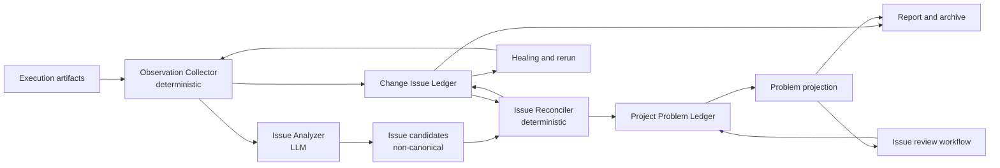
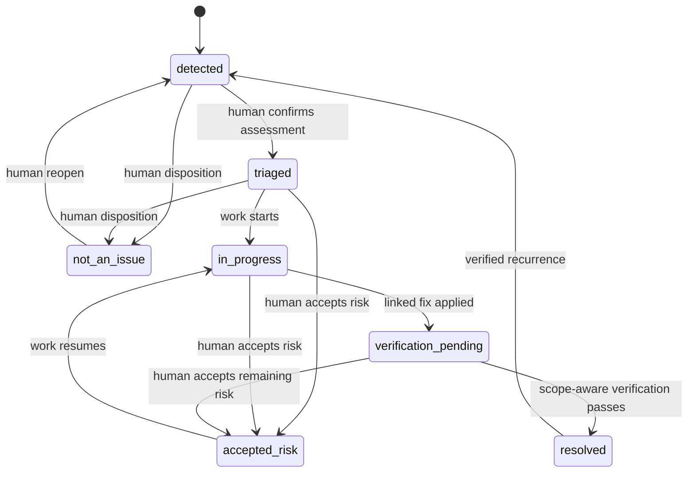

# Issue Lifecycle and Cross-Change Problem Tracking Design

**Date:** 2026-07-25

**Status:** Design approved in conversation; awaiting written-spec review

**Scope:** Full-workflow issue detection, Change-local evidence, cross-Change Problem lifecycle, reporting, archive, risk context, and retro integration

## 1. Context

The current full workflow runs:

```text
generation -> execution -> operation:inspect -> healing -> report -> archive
```

`operation:inspect` deterministically classifies failed test results and writes
`inspect/failure-analysis.json`, `inspect/quality-gate-result.json`, and
`inspect/failure-summary.md`. It does not invoke an LLM and does not materialize a
durable issue record. The separate `aa-inspect` skill describes richer analysis,
but the graph does not invoke that skill. The current known-product path also has
no valid first writer: codegen and inspect contracts do not authorize a
Change-root `known-product-issues.md` write.

Downstream history reads an archive-root `known-product-issues.md`, so structured
inspect findings and the historical consumer are disconnected. The model also
loses lifecycle information: resolved problems, false positives, accepted risk,
work in progress, regressions, and repeated occurrences are not represented as
first-class data.

This design replaces that Markdown-special-case flow with a complete Issue
Lifecycle subsystem embedded in the full workflow.

## 2. Goals

1. Preserve every abnormal execution signal as immutable, evidence-backed data.
2. Use an LLM to synthesize and cluster possible issues from a frozen evidence
   bundle, including problems hidden by passing workaround tests.
3. Keep LLM output provisional and prevent it from directly mutating canonical
   issue state.
4. Preserve each Change's historical observations and issue occurrences as an
   immutable archive snapshot.
5. Track a product-wide Problem across Changes without rewriting historical
   archives.
6. Represent the complete lifecycle, including detected, in progress, resolved,
   accepted-risk, and not-an-issue decisions.
7. Never let an Issue or incomplete LLM analysis block archive.
8. Keep execution status as execution truth; issue risk affects reports and
   archive metadata, not `final_status`.
9. Make all writes replayable, idempotent, auditable, and safe under concurrent
   Changes.

## 3. Non-goals

- Automatically editing product code from an Issue.
- Replacing the existing healing safety and verification gates.
- Using retro as the canonical Problem lifecycle owner.
- Storing reusable test-data knowledge in the Problem Ledger.
- Migrating or continuing to read legacy `known-product-issues.md` files.
- Automatically merging Problems based only on semantic similarity.

## 4. Confirmed Design Decisions

1. A Change owns immutable Observations and IssueOccurrences. A project-level
   Problem Ledger owns cross-Change identity and lifecycle.
2. Every validated LLM candidate is recorded as an IssueOccurrence. With no exact
   match it creates a `detected` Problem; an existing Problem keeps its lifecycle
   state except when a resolved Problem deterministically regresses. Low
   confidence does not cause evidence loss.
3. Observation and Issue are separate concepts. Multiple Observations may support
   one IssueOccurrence, and multiple Occurrences may refer to one Problem.
4. The LLM may propose classification, severity, root cause, fingerprint inputs,
   and actions. It cannot confirm a disposition or close a Problem.
5. Exact deterministic fingerprints may auto-link an Occurrence to a Problem.
   Semantic similarity only creates a human-review suggestion.
6. If no exact Problem exists, a validated Occurrence automatically creates a new
   `detected` Problem.
7. The analyzer runs after the initial execution and after every healing rerun.
8. Automatic resolution requires a linked fix/disposition plus scope-aware,
   successful verification evidence.
9. Issue state never blocks archive. Open issues and incomplete analysis only
   affect archive status/details and reports.
10. `known-product-issues.md` is removed rather than retained as a derived view.
    Legacy Markdown history is intentionally not migrated.
11. Human triage is handled by an independent, non-blocking
    `issue-review-workflow`.
12. LLM failure is fail-open for workflow progress and fail-visible in artifacts.

## 5. Architecture

The system uses two append-only domain Ledgers and deterministic projections.



### 5.1 Observation Collector

A deterministic operation reads the authoritative execution batch and produces a
digest-pinned evidence bundle. It collects abnormal signals from:

- selected-target results and raw logs;
- warnings, skips, xfails, and test-runner anomalies;
- coverage and performance results;
- traces, screenshots, and videos referenced by execution artifacts;
- case definitions and the generated tests that exercised them;
- fact-baseline anomalies;
- plan/review warnings and explicit workaround declarations.

The collector records Observations before any LLM call. An analyzer failure can
therefore never erase the underlying facts. The bundle contains an allowlisted
manifest and content digests; the LLM does not receive unrestricted repository
access. Existing secret-redaction and artifact-access policies apply before the
bundle is exposed to the analyzer.

### 5.2 Issue Analyzer

The Issue Analyzer is a graph agent node with a narrow write contract. It may
write only:

- `inspect/issue-candidates.json`;
- `inspect/issue-analysis-status.json`.

It groups Observations into semantic candidates and proposes classification,
severity, root-cause hypothesis, affected surface, fingerprint inputs, next
action, and possible existing Problem matches. Every candidate must cite one or
more Observation IDs. Its output is never canonical.

When there are no abnormal Observations, the graph skips the LLM call and writes
`issue-analysis-status.json` with `status: completed` and `candidate_count: 0`.

### 5.3 Issue Reconciler

A deterministic operation validates the entire candidate batch before accepting
any candidate. It validates:

- schema and supported enum values;
- evidence-bundle digest;
- every Observation reference;
- duplicate candidate/Occurrence IDs;
- fingerprint input completeness;
- claimed existing Problem IDs;
- authority constraints on classification and status.

On success it appends Change Occurrence events and Project Problem events in one
graph write-set. Project writes require the exclusive resource
`project:issue-registry`. The idempotency key is derived from
`change_id + batch_id + candidate_digest`.

Exact fingerprints link automatically. A semantic match is written to the review
queue as a possible link and does not alter either Problem until a human confirms
it.

### 5.4 Issue Review Workflow

Human decisions use an independent workflow:

```text
load-problem
  -> build-review-context
  -> llm-triage-advisor
  -> human-interrupt
  -> validate-transition
  -> append-problem-event
  -> rebuild-projection
```

The LLM advisor is non-canonical. The interrupt binds the Problem version and the
audited evidence read. The deterministic apply operation rejects stale versions,
invalid transitions, missing reasons, and missing evidence references.

Supported human actions are:

- confirm or change classification/severity;
- mark not an issue;
- accept risk;
- start work;
- confirm an Occurrence link;
- merge Problems;
- reopen a Problem;
- submit a resolution and its required verification scope.

The full workflow only enqueues `problem_review_requested`; it never waits for
this workflow.

## 6. Storage Layout and Ownership

```text
qa/changes/<change-id>/
├── inspect/
│   ├── failure-analysis.json
│   ├── quality-gate-result.json
│   ├── observations.json
│   ├── issue-evidence-manifest.json
│   ├── issue-candidates.json
│   ├── issue-analysis-status.json
│   └── issue-reconcile-status.json
└── issues/
    ├── events.jsonl
    └── snapshot.json

qa/issues/
├── events.jsonl
├── problems.json
└── review-queue.json

qa/archive/<change-id>/
└── issues/
    ├── events.jsonl
    └── snapshot.json
```

Ownership rules:

- `inspect/**` is an analysis work area and is not canonical Issue state.
- `qa/changes/<change-id>/issues/events.jsonl` is the canonical source for that
  Change's Observations and Occurrences.
- `qa/issues/events.jsonl` is the canonical source for cross-Change Problems.
- `snapshot.json`, `problems.json`, and `review-queue.json` are rebuildable
  projections.
- Archive copies the entire Change `issues/**` directory. Once archived, the
  Change occurrence history is immutable.
- Post-archive triage and resolution update only the project Problem Ledger.

## 7. Domain Model

### 7.1 Observation

An Observation is an immutable execution or workflow fact.

```yaml
observation_id: OBS-<digest>
change_id: RET-dept-management-...
batch_id: 20260725-124844
kind: test_failure
target: api
case_id: API-DEPT-NEG-001
source:
  artifact: execution/runs/20260725-124844/api-result.json
  json_pointer: /cases/3
evidence_refs:
  - execution/runs/20260725-124844/raw/api.log#L42
signature: http_500_on_empty_department_name
observed_at: 2026-07-25T04:48:44Z
```

Supported `kind` values are:

```text
test_failure | warning | anomaly | workaround | coverage_gap |
performance_signal | environment_signal | review_finding
```

`observation_id` is computed from a versioned canonical representation of
`change_id`, `batch_id`, source location, target/case identity, and normalized
signature. Replaying the same evidence produces the same ID.

### 7.2 IssueCandidate

An IssueCandidate is transient LLM output.

```yaml
candidate_id: CAND-001
observation_ids: [OBS-...]
proposed:
  title: Empty department name returns HTTP 500
  classification: product_bug
  severity: high
  root_cause_hypothesis: Request validation is missing before persistence.
affected_surface:
  kind: endpoint
  value: POST /api/v1/dept
fingerprint_inputs:
  surface: POST /api/v1/dept
  symptom: invalid_empty_name_returns_500
possible_problem_ids: []
confidence: 0.91
recommended_action: Add request validation and verify the negative case.
```

Confidence is advisory. It never grants authority to close, merge, or confirm a
Problem.

### 7.3 IssueOccurrence

An IssueOccurrence records what a specific Change discovered.

```yaml
occurrence_id: OCC-<digest>
change_id: RET-dept-management-...
batch_id: 20260725-124844
observation_ids: [OBS-...]
problem_id: PROB-<digest>
provisional_assessment:
  classification: product_bug
  severity: high
  authority: llm_provisional
  root_cause_hypothesis: Request validation is missing before persistence.
analysis:
  evidence_bundle_digest: sha256:...
  analyzer: issue-analyzer
  prompt_version: "1"
  candidate_digest: sha256:...
```

An Occurrence does not own a mutable lifecycle. Its Problem reference and the
analysis performed at that time are historical facts.

### 7.4 Problem

A Problem is the project-level, cross-Change identity.

```yaml
problem_id: PROB-<digest>
fingerprint:
  version: "1"
  digest: sha256:...
title: Empty department name returns HTTP 500
assessment:
  classification: product_bug
  severity: high
  authority: llm_provisional
status: detected
first_seen:
  change_id: RET-dept-management-...
  occurrence_id: OCC-...
last_seen:
  change_id: RET-dept-management-...
  occurrence_id: OCC-...
occurrences: [OCC-...]
resolution: null
version: 1
```

Human confirmation replaces `authority: llm_provisional` with
`authority: human_confirmed`. Deterministic verification may update resolution
state but cannot invent classification or severity.

## 8. Fingerprinting and Linking

The reconciler, not the LLM, computes a versioned Problem fingerprint from a
canonical object containing:

- affected-surface kind;
- normalized affected-surface identity;
- normalized symptom signature;
- stable behavior/context qualifiers required to avoid obvious collisions.

Titles, free-form root-cause hypotheses, confidence, severity, and Change IDs are
excluded because they are unstable or occurrence-specific.

The linking policy is:

1. Exact fingerprint match: automatically link and append a new occurrence.
2. No exact match: create a new `detected` Problem.
3. Semantic similarity: add possible Problem IDs to the review queue.
4. Human-confirmed merge: append a `problem_merged` event that aliases the source
   Problem to the target. Historical events are never rewritten.

## 9. Problem State Machine



Authority rules:

- LLM-created Problems always start at `detected`.
- `triaged`, `not_an_issue`, `accepted_risk`, and reopen require an audited human
  action with a reason and evidence references.
- A linked healing apply may transition `in_progress` to
  `verification_pending`.
- Automatic `resolved` requires all of:
  1. a linked fix/disposition record;
  2. an authoritative later batch that selected the required target;
  3. execution of every linked verification case;
  4. passing verification cases;
  5. absence of the Problem fingerprint in the later batch.
- If the required verification scope did not run, the Problem remains
  `verification_pending`.
- An exact occurrence of a resolved fingerprint appends `problem_regressed` and
  transitions the Problem to `detected`, while retaining prior resolution
  history.

## 10. Ledger Events and Projections

### 10.1 Change Issue Ledger Events

```text
observation_recorded
issue_analysis_completed
issue_analysis_failed
occurrence_detected
occurrence_linked
project_sync_pending
```

Each event contains schema version, event ID, idempotency key, Change/batch ID,
timestamp, payload, and evidence digest. The Change `issues/snapshot.json`
projection contains all Observations, Occurrences, analysis status, and project
sync status for the latest authoritative batch without erasing prior batches.

### 10.2 Project Problem Ledger Events

```text
problem_detected
problem_occurrence_linked
problem_assessment_confirmed
problem_work_started
problem_verification_requested
problem_resolved
problem_marked_not_an_issue
problem_risk_accepted
problem_reopened
problem_regressed
problem_merge_suggested
problem_merged
```

Every mutating event carries `expected_problem_version`. Projection rejects an
event whose precondition version does not match. The review workflow must reload
and re-present context rather than silently applying a stale decision.

`qa/issues/problems.json` is rebuilt by ordered replay. Given identical event
bytes, projection output must be byte-for-byte deterministic.

## 11. Full Workflow Integration

The Issue detector is embedded in the full workflow; it does not run only after
the workflow finishes.

```text
generation
  -> execution
  -> inspect-with-issues
       -> inspect-classify
       -> collect-observations
       -> analyze-issues
          -> reconcile-issues                 # successful analysis
          -> record-analysis-failure          # recoverable failure after retries
       -> inspect-complete
  -> healing
       -> rerun
       -> inspect-with-issues
       -> decide
  -> report
  -> archive
```

Rules:

- `run_tests: false`: execution and the Issue subgraph do not run.
- Initial execution and every healing rerun invoke the complete Issue subgraph.
- The report reads the final authoritative Change Issue projection and the latest
  Project Problem projection.
- With `auto_archive: true`, archive copies the final reconciled Change
  `issues/**` snapshot available at that point.
- The independent review workflow may run before or after archive and never
  blocks the full workflow.

### 11.1 Required Recoverable-Failure Route

The current graph runtime treats an agent failure after retry exhaustion as a
terminal task failure. That behavior cannot implement the confirmed analyzer
fail-open requirement. This feature therefore includes one minimal graph control
capability: a node may declare a typed recovery route for an allowlist of errors.

Conceptually:

```yaml
analyze-issues:
  uses: skill:aa-issue-analyzer
  recover:
    errors: [timeout, transport, rate_limit, invalid_output]
    via: record-analysis-failure
    continue_to: inspect-complete
```

Recovery runs only after the declared retry policy is exhausted. The failed
node's write-set is discarded. The deterministic recovery operation writes an
empty candidate document and `issue-analysis-status.json` with the pinned
evidence digest and typed failure reason, then continues the graph.

The recovery allowlist does not include `forbidden_write`, corrupt Ledger state,
compiler errors, or invalid workflow contracts. Those are workflow-integrity
defects, not Issue-analysis outcomes, and remain hard failures. Compiler and
scheduler support for this narrowly defined recovery route is part of the
implementation scope; an issue-specific operation that hides an LLM call is not
an acceptable substitute.

## 12. Failure, Retry, and Concurrency Semantics

### 12.1 Analyzer Failure

Timeout, transport failure, unavailable model, or invalid LLM output produces a
typed analysis status:

```yaml
status: pending | failed
reason: timeout | transport | invalid_output | unavailable
evidence_bundle_digest: sha256:...
retryable: true
```

The workflow continues. It does not fabricate candidates or fall back to treating
keyword classifications as canonical Problems. A later standalone retry may use
the same evidence digest. Continuation uses the recovery route defined in Section
11.1; the analyzer handler itself must not report a failed call as success.

### 12.2 Semantic Validation Failure

The reconciler validates the complete candidate list. Any semantic error rejects
the entire list and writes a failed reconcile status. It must not partially append
Occurrences or Problems.

### 12.3 Project Synchronization Failure

Observation events have already committed before analysis. A Project Ledger
conflict is retried under `project:issue-registry`. If retries are exhausted, the
Change records `project_sync_pending` with the candidate digest and error class.
The workflow still reaches report/archive, which must display the pending state.
The retry entrypoint is idempotent.

### 12.4 Concurrent Changes

Only the deterministic reconciler and review apply operation may write the
Project Problem Ledger. Both require `project:issue-registry`. They reload the
latest projection after acquiring the lock and use expected versions. Two Changes
with the same exact fingerprint therefore create one Problem with two linked
Occurrences.

### 12.5 Execution Integrity

Issue fail-open semantics do not weaken execution-evidence integrity checks.
Missing or corrupt execution evidence continues to use the existing execution and
inspect failure policy. Issue state never rewrites execution `final_status`.

## 13. Reporting and Archive Semantics

The quality report adds an Issue section containing:

- analysis status: `completed | pending | failed`;
- project sync status: `completed | pending`;
- counts by Problem status, classification, and severity;
- new, repeated, regressed, resolved, accepted-risk, and not-an-issue items;
- evidence-backed release guidance.

The Issue risk level is computed separately from execution status:

```text
unknown  analysis or project sync incomplete
critical highest active severity is critical
high     highest active severity is high
medium   highest active severity is medium
low      highest active severity is low
clear    all linked Problems are resolved/not_an_issue, or no Issue exists
```

`accepted_risk` remains active for reporting and retains its severity. It is not
reported as clear.

Archive is never stopped by Issue state. It uses:

- `archived_with_warnings` when analysis/sync is incomplete or any linked Problem
  is `detected`, `triaged`, `in_progress`, `verification_pending`, or
  `accepted_risk`;
- the normal archived status when the Issue dimension is clear.

Other existing non-Issue archive gates remain unchanged. Archive summary wording
must distinguish test execution outcome from Issue risk.

## 14. Risk, Retro, and Data-Knowledge Integration

### 14.1 Risk Context

`risk/context.py` reads the structured Project Problem projection instead of
archive-root Markdown.

- Active Problems enter future Change risk context.
- Resolved Problems remain available as regression signals.
- Not-an-issue Problems provide negative context so the analyzer does not
  repeatedly classify the same evidence as a product defect.
- Accepted-risk Problems remain visible and active.

### 14.2 Retro

Retro consumes Change Issue events, Project Problem events, review decisions, and
resolution outcomes to propose workflow, prompt, fixture, and test improvements.
It is not authorized to create, merge, close, or otherwise mutate Problems.

### 14.3 Data Knowledge

`.aa/data-knowledge.yaml` continues to store reusable data-construction and
execution knowledge. A Problem resolution may supply evidence for a retro
knowledge proposal, but it cannot directly update data knowledge. Existing
proposal validation and acceptance remain the promotion boundary.

## 15. Removal and Compatibility Policy

The new workflow neither generates nor reads `known-product-issues.md`.

- Skill instructions that name it are updated to use the Issue APIs/artifacts.
- Execution and codegen contracts remove any implied Markdown behavior.
- Risk context removes the Markdown parser from the new path.
- Existing archived Markdown files are left untouched but ignored.
- No one-time migration or indefinite legacy fallback is implemented.

This is a deliberate clean cut: structured lifecycle history begins with the
first workflow version that emits Issue Ledger events.

## 16. Testing Strategy

### 16.1 Unit Tests

- deterministic Observation, Occurrence, Problem, and fingerprint IDs;
- candidate batch all-or-nothing validation;
- every legal and illegal Problem state transition;
- exact linking, semantic suggestion, human merge, and alias projection;
- scope-aware resolution and regression;
- risk filtering for active, resolved, accepted-risk, and not-an-issue Problems;
- byte-identical projection replay.

### 16.2 Graph and Contract Tests

- analyzer can write only candidate/status artifacts;
- analyzer cannot write either Ledger;
- reconciler holds `project:issue-registry`;
- retry, crash/resume, and write-set replay commit each logical event once;
- concurrent exact matches create one Problem with two Occurrences;
- semantic similarity never auto-merges.

### 16.3 Workflow Integration Tests

- initial inspect creates Observations, Occurrences, and Problems before report;
- every healing rerun repeats analysis/reconciliation;
- linked fix plus authoritative verification reaches resolved;
- missing verification scope remains verification-pending;
- analyzer failure continues to report/archive with visible pending state;
- open critical Problems never block archive;
- Issue state never changes execution `final_status`;
- post-archive review changes only the Project Problem Ledger;
- archive Issue snapshot digest remains unchanged after later review;
- `run_tests: false` skips the Issue subgraph;
- no new path generates or reads `known-product-issues.md`.

Scripted fake analyzer responses drive deterministic integration tests. Separate
evaluation tests measure LLM classification quality and must not replace protocol
tests.

### 16.4 Consumer Tests

- risk context selects the correct Problem statuses;
- resolved exact fingerprint recurrence emits regression;
- retro reads Issue evidence but cannot mutate Problem state;
- data-knowledge changes still require a validated retro proposal.

### 16.5 Benchmark Acceptance

The vue-fastapi-admin benchmark must demonstrate:

- an ordinary HTTP 500 can become a product-bug candidate without a pre-existing
  known-product marker;
- a passing workaround test can still create an Observation and Occurrence;
- repeated API/fuzz evidence with one exact fingerprint links to one Problem;
- test-code failures do not merge into a product Problem;
- analyzer failure loses no Observation and supports idempotent later retry.

Hard acceptance metrics are:

1. Every abnormal Observation has at least one valid evidence reference.
2. Exact-fingerprint duplicate Problem count is zero.
3. Ledger replay produces byte-identical projections.
4. Observation loss under LLM failure, retry, or crash is zero.
5. Archive blocks caused by Issue state are zero.
6. Unauthorized transitions into `resolved`, `not_an_issue`, or `accepted_risk`
   are zero.

## 17. Implementation Boundaries

The implementation plan must preserve these module boundaries:

- evidence collection does not perform semantic issue analysis;
- LLM analysis does not write canonical state;
- reconciliation owns validation, identity, and Ledger writes;
- projection is a pure replay function;
- review owns human decisions, not evidence discovery;
- report/archive are consumers, not lifecycle writers;
- retro proposes reusable learning, not Problem state changes.

Refactoring outside these boundaries is out of scope unless required to enforce a
declared write contract or deterministic replay invariant.
