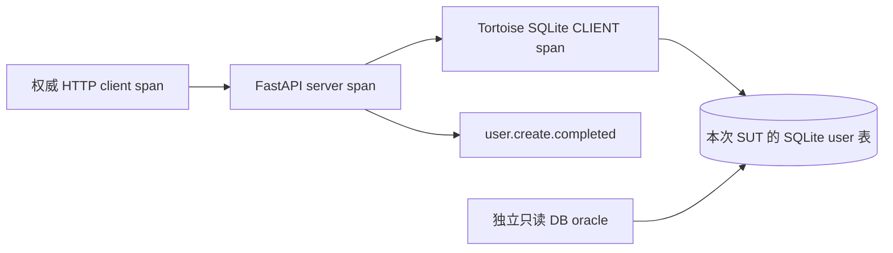

# 业务规格驱动的 User 全流程验证：DB oracle 与 OTel 链路

日期：2026-09-06

基线适配：origin/main `1b4187660e273183a9aab71f63fd8ee70d4dddcc`；保留原业务约束与 A01–A26，按当前 Python StateGraph/semantic attempt 接线。此 worktree 副本与同目录实施 Plan 配套；原主工作区文档仅为历史来源。

状态：Draft — 待评审的实施规格；本文件不表示功能已经实现

范围：阶段一「规格、机器计划、权威执行、一个 DB oracle」；阶段二「同一流程接入实际 DB 的 OTel 插桩及一个必需业务检查点」

基准项目：当前仓库的 `benchmark/vue-fastapi-admin`

首条业务流程：`POST /api/v1/user/create` 创建用户；两阶段均通过完整 Assurance workflow 验收

## 1. 问题与目标

当前项目能生成业务用例、计划和测试，验证生成文件的路径、摘要及 Case ID 映射，但不能确定性保证每项业务预期被实际检查。用例 assertions 数组非空、pytest 通过以及 Agent 提交结构化结果，都不足以证明进行了有效校验。现有 assertion_strength 主要汇总外部统计，现有 trace.v2 是需求到测试结果的追溯投影，不是分布式遥测。

本功能将以下关系形成机器可验证的闭环：

**业务目标/不变量 → API 动作 → 必需业务检查点及关联约束 → 独立状态断言 → 证据完成条件。**

人可读业务用例是预期的来源；机器计划是派生产物。代码证据用于定位路由、数据库字段和插桩位置，不自动决定什么行为正确。最终结果由已安装执行模块采集的证据和确定性裁判计算。

两阶段均须从 User 的需求输入走实际 benchmark 的完整产品 workflow：用例设计、机器计划、测试生成、权威执行、质量判定、适用的修复与重跑、报告及交付。不能从手工准备好的计划直接调用 runner，就宣称全流程完成。第一阶段不要求 OTel；第二阶段沿用同一业务预期和同一 DB oracle，新增冻结的业务与数据库 Trace 义务。

## 2. 范围与方案选择

选择扩展现有 intake、generation、execution、quality、healing 模块，并新增已安装 `assurance.telemetry` 能力；复用受限 subprocess runner、产物声明、版本摘要和图调度。只增加这条执行链必须的数据与执行能力。不改 full 拓扑。

比较过的方案：

| 方案 | 判断 |
| --- | --- |
| 仅强化 codegen/reviewer 提示词 | 不满足必需检查实际执行的确定性保证，不采用 |
| 现有模块增加结构化执行义务、独立观察与确定性判定 | 阶段一（API + DB oracle）采用；第一版限定同步 API 与 SQLite |
| 建设通用 Trace 测试平台或重写图引擎 | 超出两阶段验证所需范围，不采用 |
| 项目/SUT 可加载 OTel 或 CAT 插件 | 引擎不扫描 SUT；被测对象自报齐不能当 PASSED。不采用 |
| 已安装 `assurance.telemetry` wheel，产品按 profile 装配 | 阶段二采用。图走法不变；OTel 文件是第一种实现，CAT 等为后续已安装实现 |

新模式使用两个显式 profile：`api_db.v1` 与 `api_db_trace.v1`。profile 在计划编译前选择并冻结；执行失败后不得自动从后者降级到前者。

二者由同一个闭集参数 `validation_profile` 选择，来自项目部署配置/显式 benchmark 项，不是两个独立开关。选择依据是已认可的验收要求；能力预检只决定能否执行，不自动降低要求。选定 Trace 模式但未安装或未认证 telemetry 能力时为 NOT_READY；执行中缺少必需遥测为 INCOMPLETE。两种模式复用既有 full 节点，新增的是节点内部对已安装端口的调用，不新增 Agent、顶层节点、按厂商分叉的图，也不新增 `api_db_otel.v1` / `api_db_cat.v1`。

这里的 full workflow 指所选 User API 用例经过完整产品生命周期，不表示本次同时实现所有测试类型，或强制走完所有条件分支。验收项选择 `system/user`、`selected_test_families=[api]`，将首个交付目标明确限定为创建用户并正确持久化。现有 User 需求中的更新、删除、密码重置、权限及角色关联等其余场景保留为后续范围，不能宣称已验证整个 User 模块。

第一版不实现 UI 驱动接入、Redis、Kafka、Fuzz、Performance、跨服务消息拓扑、通用 SQL DSL、APM 管理界面或自动业务规则推断。现有其他测试能力继续工作，但不能被标记为已获得新验证保证。

### 2.1 遥测能力：对图侵入最小

阶段二的目标是把「要不要 Trace」和「用哪种链路材料」分开。图只认前者；后者是已安装实现，由 ProductLock / GraphRevision 认证，不出现在 YAML 走法里。

**图不变。** full 仍是既有 `validate → prepare → case → execute-tail → achieved | 再覆盖`；`execute-tail` 内仍是既有 execute → quality →（必要时）heal。禁止为 flush、封存、OTel、CAT 增加节点或边，禁止按 profile 编译两张不同拓扑的图。compile 认证 telemetry 插件已安装发生在组产品、锁依赖时；未通过则 `NOT_READY`，图不开始走。

**一种 profile，多种已安装实现。** `api_db_trace.v1` 表示「本计划的 Trace 义务 required」。第一版实现是 OTLP JSONL（Demoso：进程内 file exporter，driver 注入关联上下文，事后按本次链路身份拉取）。后续 CAT 或其他 APM 是另一个已安装实现（独立 wheel 或同一插件的另一 provider），换的是装配与材料格式，不是图、不是 quality 文案、不是新的 validation_profile。没装或 digest 漂移：`NOT_READY`，不得静默当成 `api_db.v1`。

**端口按材料说话，不按厂商说话。** execute / quality / 图状态机不得把 `otlp`、`traceparent`、`cat` 写成节点契约或路由条件。厂商词只留在 telemetry 实现与 SUT adapter 内部。端口只有三句：

1. **Execute → Telemetry：** 本次 `execution_id` / SUT 实例 / 材料路径；注入本次 Attempt 的关联上下文；动作与独立 SELECT 结束后，flush 并交出封存引用。
2. **Telemetry → 密封字节：** 权威输出是 completion 记录 + 原始材料文件 + digest。谁都可以读文件，谁都不能改义务。
3. **Quality → Telemetry 契约：** 打开上述材料，加上计划里冻结的 Trace 义务，重算齐 / 不齐。quality 不 import execution 的 operations，也不 import 任一厂商 exporter。

Execution 仍拥有 Attempt、HTTP、SQLite oracle 与 journal；只把遥测封存引用记进 journal。Generation 只声明义务，不读 case 去猜链路。SUT 插桩（FastAPI/Tortoise 装 SDK，或未来的 CAT agent）留在 benchmark fixture / adapter wheel，不是编排插件，也不得从 `.aa/` 加载 Python handler。

本阶段不实现 CAT。CAT 只约束口子：以后换实现时不得改 full 图、不得加厂商 profile、不得让 SUT 自证 PASSED。

## 3. Benchmark 事实与业务规格来源

### 3.1 已核查的实现事实

当前 benchmark 使用 FastAPI 0.111.0、Tortoise ORM 0.23.0、aiosqlite 0.20.0 与 SQLite。当前 app 和依赖中没有发现 OTel 插桩，第二阶段需要新增接入。

User 模型的表名为 `user`，模型默认连接是 `sqlite`，使用 `tortoise.backends.sqlite`，文件为运行实例的 `BASE_DIR/db.sqlite3`。因此第二阶段必须沿 **FastAPI → Tortoise ORM → aiosqlite → SQLite** 的实际调用路径接入；不得接一套无关的 PostgreSQL/MySQL 样例来替代。

创建路由先按 email 查重，controller 对密码做 hash 并保存 User，再清理和设置角色，最后返回成功 envelope；响应没有新建实体 ID。实际 API 前缀是单数 `/api/v1/user`。第一版按本次唯一 username 与 email 关联实体，不为获取 ID 修改公开响应契约。

当前 User 创建路由与 controller 没有覆盖整个创建及角色更新的 `@atomic`/`in_transaction`；SQLite backend 默认自动提交。不能将“函数成功返回”解释为已有跨步骤事务，也不能把写入之后抛异常当成实际回滚。第 12.3 节单独定义真实回滚故障变体。

现有 benchmark 的 User 需求覆盖 CRUD、邮箱唯一性、角色和部门关联、密码重置。本 spec 明确补充下述最小成功创建验收语义，评审后作为规范来源冻结；实现中的默认值、当前返回结果不自动成为预期正确性的来源。

### 3.2 首条人可读业务用例

| 项目 | 冻结的业务约束 |
| --- | --- |
| 目标 | 管理员创建一个此前不存在的用户，并在操作成功后持久保存本次约定的账户字段 |
| 初态 | 本次 username 和 email 均不存在；合法测试管理员可调用创建接口 |
| 输入 | 每个测试尝试唯一的 username（不超过 20 字符）与合法 email；明确 is_active=true、is_superuser=false、dept_id=null、role_ids=[]；密码引用运行期测试凭据 |
| API 预期 | HTTP 200，响应业务 code=200；不依赖成功文案原样匹配 |
| DB 预期 | 独立连接读取已提交状态：以 username 或 email 命中的集合恰好一行；username、email、is_active、is_superuser、dept_id 与本次冻结输入相等 |
| Trace 预期 | 仅阶段二要求：当前 HTTP 动作关联到 SUT 的真实 SQLite 用户持久化调用，并观察到 `user.create.completed` 业务检查点；两者属于同一 action 与 SUT 实例 |
| 完成 | 同步 API 动作已有终态；独立 DB 查询完成；阶段二还需必需 Trace 证据到达并完成采集封存 |

username 由执行模块生成不超过 20 字符的运行标记，email 使用同次生成的唯一标记和符合 EmailStr 校验的测试域名，总长不超过 255 字符。实例绑定冻结前最多尝试分配 3 次以避开碰撞；选定后将二者写入本次实例绑定并冻结。冻结后的初态检查若发现任一值已有记录，必须阻止动作，不能再悄悄换值或复用记录。每个参数实例和显式重试使用新的 username/email。

SQL oracle 只选择上述业务列；禁止导出 password、认证 token 或请求凭据。密码 hash 正确性、角色关联表和跨步骤原子性不属于本条用例已验证的业务义务，不能由这一条通过推导出来。

DB 的预期是明确的业务字段及存在性，不包括固定主键值、生成时间、ORM 方法名、SQL 文本或 SQL 调用次数。字段与表的对应关系属于实现绑定，可以在保持业务语义的重构后更新。

## 4. 用户故事

1. 作为用例作者，我希望用业务语言表达创建目标和持久化预期，使规格不绑定 ORM 实现。
2. 作为评审者，我希望知道每条预期来自哪条需求和哪个规格版本，避免把现存缺陷当成正确行为。
3. 作为测试生成者，我希望从冻结规格得到明确动作和 oracle 绑定，使必需检查无法被遗漏。
4. 作为执行者，我希望 API 请求与数据库查询属于同一个受控 SUT 实例，避免读错数据库。
5. 作为使用者，我希望成功响应但未落库时得到失败，而不是通过。
6. 作为使用者，我希望 DB 读取失败或必需检查未执行时得到不完整结论，而不是误报业务正确。
7. 作为使用者，我希望 Trace 缺失与业务失败被区分，便于判断应修复业务还是证据采集。
8. 作为维护者，我希望正常重构函数、SQL 或辅助 spans 时测试继续通过，只约束已约定业务语义。
9. 作为恢复执行的操作者，我希望重复运行和重试不会使用上一轮证据，也不会不知情地重复提交创建请求。
10. 作为质量负责人，我希望覆盖统计来自逐项实际证据，且缺失、跳过不能缩小分母。
11. 作为修复 Agent 的使用者，我希望自动修复不能通过删除 oracle 或放宽预期来获得通过。
12. 作为现有项目使用者，我希望旧测试保持可运行，同时清楚区分旧结果与新契约的验证保证。

## 5. 术语与权威

| 术语 | 定义与权威 |
| --- | --- |
| Business Case | 人可读、经评审的业务规格，拥有预期与业务不变量 |
| Obligation | 必须被验证的一项义务；有稳定 ID，可对应动作、状态断言或检查点 |
| Case Execution Plan | 对业务规格的派生执行绑定；不是现有 Agent runtime execution-contracts 配置 |
| Oracle | 已安装的观察/比较能力；实际值来自观察，预期引用冻结业务规格 |
| Execution ID | 一次具体参数化用例的真实执行身份；关联既有 invocation/task/attempt/nodeid，不新建平行的四层 ID 体系 |
| Evidence | 执行模块采集并保存的 receipt、观察值及原始材料，不等同于测试或 SUT 自报成功 |
| Verdict | 质量模块依据冻结契约与证据计算的结果；Agent 叙述不覆盖它 |

本功能的信任范围是受控本地 benchmark 与已安装的执行/观察代码，不提供针对恶意 SUT 的密码学执行证明。文件摘要证明材料身份和版本一致性，不能证明业务行为正确。

## 6. 规格、来源与机器计划契约

### 6.1 业务规格与来源

新模式将业务断言升级为带稳定 assertion/obligation ID 的明确结构。每条断言包含可读 statement、有限类型的预期及比较语义；不得以空字符串、空对象、任意散文或代码表达式替代执行义务。

保留 case.yaml 的业务内容。新增正式的预期来源记录，按 case/assertion ID 关联需求引用、规范版本、决策状态和评审引用；不把 Explore 的全部 advisory 元数据复制到 case。来源记录和 case 内容由运行时计算摘要并冻结。

规范来源与 implementation references 分开。源码观察、正常运行录制或 `source_verification` 不得单独将候选预期升级为 ready。未确定的预期使该用例计划 `NOT_READY`，不能由 codegen 猜测 expected。

### 6.2 机器计划

`CaseExecutionPlanV1` 是新增的机器契约，使用 JSON、闭合 schema 和运行时确定性序列化。至少包含：

| 字段组 | 必需内容 |
| --- | --- |
| 规格绑定 | case ID、规格引用/摘要、预期来源摘要、选定 profile、义务目录摘要 |
| 实现绑定 | SUT 版本、支持的动作/observer/checkpoint ID 与版本、配置摘要 |
| 实例输入 | 参数声明和来源、运行期允许绑定的 username/email 与受控凭据引用；禁止绑定时改写业务预期 |
| 动作 | 计划内静态 action key、已安装的 HTTP driver、method/path、请求参数、响应预期 ID；不额外生成运行期 action ID |
| DB oracle | oracle ID、初态检查、已安装 SQLite observer、参数化只读查询绑定、结果比较和预期 ID |
| Trace | 阶段二的业务检查点 ID/版本、SQLite 持久化调用义务、插桩绑定及关联约束；阶段一明确 not_required |
| 完成 | 同步动作语义、各等待上限、证据完成要求、缺失处理 |
| 闭集映射 | 每项必需义务到一个受支持执行绑定；关联现有 Case ID → test symbol/file mapping |

第一版支持的比较能力限于 exact row cardinality、字段相等、HTTP 状态与 envelope code；不提供任意 Python/CEL 插件执行。SQL 绑定必须为经校验的参数化只读查询，表/列来自固定适配，不允许在参数里注入 SQL。

机械校验必须拒绝：缺失或重复义务、悬空 expected ID、规格摘要不匹配、空必需集合、未知 observer、缺少必需 binding、profile 与 Trace required 冲突。计划遗漏在执行前得到 `NOT_READY`，不启动业务动作。

codegen 输出仍是 raw tests 及映射；执行契约、来源记录等机器产物遵循现有 typed artifact 声明和 materialization 机制。生成器不得修改冻结的业务预期。源码静态检查可补充明显错误提示，但 assert 个数不是有效性判据。

## 7. 权威执行、身份与环境

### 7.1 测试与执行模块的职责

复用现有受限 subprocess runner，在新 profile 的产品执行链上将它接为权威执行路径。Agent 负责生成与解释，不能通过 structured_result、pytest exit=0 或手写 receipt 宣告义务已完成。

生成的 pytest 入口通过已安装的执行桥接调用指定计划。桥接是通往父级 execution host 的窄 IPC，不是在同一 pytest 进程中直接运行 observer 并把返回字典当权威证据。父级 host 持有冻结计划、实际 HTTP driver、DB observer 和证据目录；子进程只能请求执行已分配的计划/实例，不能传入新的 SQL、expected、完成状态或 evidence 路径。IPC 请求绑定当前子进程会话与 attempt，并拒绝重复动作请求。若测试入口没有调用桥接，所选义务缺少记录，结果为 `INCOMPLETE`。

允许一个很薄、没有显式 Python assert 的入口在执行模块实际完成全部义务后通过。禁止将 `pass`/`assert True` 的语法形状直接等同于失败，也禁止只因 pytest 通过而补写 oracle 完成记录。

pytest 原始报告先作为子进程输出接纳，只证明测试收集与 runner outcome；它不是业务 oracle 的权威结论。动作 receipt、DB 观察、Trace 原始材料的接纳和最终证据清单由父级执行模块控制。权威存储在子进程可写集合之外，测试/Agent 自写的同名文件不进入接纳路径。执行后端必须验证并实施此进程/写集隔离；无法提供时新 profile 为 NOT_READY，不能以目录命名约定冒充隔离。重复或冲突证据按身份与摘要检测，不能采用“最后写入覆盖”。

### 7.2 身份

每次具体参数化用例实际执行，仅新增一个 `execution_id`；执行器内部记录它对应的既有 invocation/task/attempt 和完整 pytest nodeid。初版一条创建动作直接沿用该 execution_id。计划内的 case/assertion/action/checkpoint key 是静态引用，不再为各层生成独立运行期 ID。

当前 batch ID 是输入内容摘要，继续用于内容身份；不得充当唯一 execution_id。动作、DB 观察、Trace 关联均绑定本次 execution_id 与唯一用户业务键；OTel 自身的 trace/span ID 正常保留。请求无需再逐层透传 run/case/attempt/action 四套标签，旧执行证据不能补齐新执行。

第一版不自动重试业务 POST。动作已开始但终态 receipt 丢失时，不根据缺失结果直接重新发送请求；先记录不完整。用户或调度策略发起的真实新尝试必须使用新的 execution_id、username/email 和受控环境。恢复仅可复用同一 execution_id 下已落盘且匹配摘要的证据。

固定环境策略放在项目 `.aa/` 声明式配置；执行器准备环境后自动生成本次运行清单，包含 execution_id、case/plan 引用与摘要、既有 workflow 身份、实际 SUT 地址/实例、SQLite 绝对路径、冻结输入和证据位置。该清单按正式运行产物保存并在动作前冻结，不是人工填写的 config，也不为每个节点另建一份配置；实际执行证据另行记录并关联该清单。

### 7.3 SUT 与 SQLite 隔离

本 worktree 不含被忽略的 app/依赖文件；先以已跟踪最小源快照重建项目，新模式禁止 `_resolve_sut` 回退原工作区，并由执行host拥有SUT生命周期，不进入旧的固定端口/前端runtime。复用 benchmark 的 run-scoped runtime 副本思路，每个验证尝试启动独占 managed SUT，并绑定监听地址、进程/实例 ID、实际 SQLite 绝对路径、代码/配置摘要。不得仅因为某个端口的服务 ready 就复用未知实例。

执行者和 SQLite observer 必须确认同一个环境绑定。复制初始数据库应使用 SQLite 一致性备份或已停止的种子库，不能忽略 WAL 后直接复制活跃主文件。不得读取或修改 benchmark 原始数据库来完成业务动作。

初始准备只提供管理员和必要基础数据，不预先创建目标用户。独立只读连接先确认本次 username 和 email 均不存在，API 动作后重新读取已提交状态；不得复用 SUT ORM session、未提交事务或响应缓存作为 DB oracle。服务端实际连接文件和 observer 文件绑定必须一致；测试身份或 OTel 属性中的路径声明不能单独替代环境核验。

环境不匹配、初态不满足、数据库不可读均不得运行或宣称通过；归为执行环境证据错误，不自动生成业务缺陷。证据先封存再清理；失败/不完整尝试保留诊断材料，清理不得篡改判定。

## 8. 阶段一：独立 DB oracle

第一版实现一个 SQLite observer 能力，承担本用例初态与后态读取。初态须确认 username 或 email 命中为零行；后态以同一组冻结参数查询 `user` 表的约定列，必须返回原始有限 rowset，再由固定比较器检查恰好一行与字段值。使用 OR 同时捕获两种业务键的碰撞，不以仅查询一个字段掩盖另一字段错误。

后态读取发生在同步 HTTP 动作已有终态之后。成功响应承诺已提交，因此目标记录不存在或字段错误是业务失败；不通过反复等待把同步提交错误掩盖成最终成功。

HTTP 超时且执行是否完成未知时，不把当时查不到行直接解释为业务未创建；记录动作未收敛及相关观察，最终 `INCOMPLETE`。查询抛错或超时也与“查询成功且返回零行”区分。

每项观察保存：oracle/obligation ID、执行身份、环境绑定、读取时刻、查询绑定摘要、实际 rowset/受控引用、执行结果与错误原因。预期从冻结规格读取，不从 DB 当前值、Trace 属性或模型输出回填。

阶段一通过的声明仅为「API 动作与 DB 业务契约已验证」，Trace 状态为 not_required，不显示“完整链路已验证”。

## 9. 阶段二：实际 SQLite 插桩与一个业务检查点

第一版材料是 OTel JSONL；义务与判定按第 2.1 节端口，不把 OTel 写进图。第 9.1–9.3 节是第一种实现的接入细节，不是第二种实现的预埋协议。

### 9.1 接入方式

按 benchmark 的实际技术栈接入 OTel Python SDK、FastAPI instrumentation、官方 `opentelemetry-instrumentation-tortoiseorm`。导出走 Demoso 模型：SUT 进程内 file exporter 写 JSONL（`observed.otlp.jsonl` / 封存名 `telemetry.otlp.jsonl`），不经上游 Collector。官方 Tortoise 插桩覆盖 SQLite backend 的异步 execute 方法，在调用方上下文创建 CLIENT span 并等待真实数据库调用返回；它符合当前 Tortoise → aiosqlite 路径，优先复用，不另建通用驱动插件。

不能只安装 `opentelemetry-instrumentation-sqlite3` 就声明链路接通：当前 aiosqlite 使用工作线程及连接快捷执行方法，须避免上下文丢失和未经过被包装 cursor 的旁路。实施前锁定兼容版本，以当前 Tortoise 0.23.0 / aiosqlite 0.20.0 的真实 User.save 验证父链、成功/异常及事务变体。库的支持声明不能代替此兼容验收。

权威 HTTP driver 创建本次动作的 client span 并通过 W3C trace context 注入请求。FastAPI 创建 server span；受控请求 hook 仅传播允许的测试身份字段。真实 SQLite 调用与业务检查点在同一请求上下文中产生。测试身份不是业务预期，不能把 expected 值或通过结论注入 SUT。

必需链路如下；业务检查点可以是请求下的独立子 span，不要求它是先前 DB 调用的父节点。



图中 oracle 是独立状态读取，不属于待验证的 SUT 写入链路。即使 observer 自身也被插桩，其 service/scope 和角色须标为 oracle；它的 SELECT span 不能满足 SUT 用户持久化义务。

第一版采用 Demoso 采集：SUT 进程内 file exporter 追加原始 OTLP JSONL。执行模块按本次 `trace_id`（W3C `traceparent`）过滤后归一化；不自建 APM 查询服务，不以 debug 日志文本作为 Trace 数据接口，不启动独占 Collector。

SDK/instrumentation 锁定具体版本；运行时版本不支持则预检失败，不静默跳过。file exporter 的原始格式不是本产品的业务契约，产品只公开自己的版本化归一模型。按 `trace_id` 拉取本次链路，不把文件里其他请求的 span 算进本次判定。独占 SUT/SQLite 不是 Trace 完整性条件。

### 9.2 业务检查点与 DB 调用约束

唯一新增的业务检查点类型为 `user.create.completed`，语义版本为 1，表达本次创建处理的既定步骤正常返回，不声称所有业务字段正确，也不声称 User 与角色更新具有跨步骤原子性。

它必须在路由等待 `user_controller.create_user(...)` 与 `user_controller.update_roles(...)` 均正常返回之后、返回成功 envelope 之前产生，或在重构后的等价处理完成位置产生。不得为获得该检查点而改变正常 SUT 的事务语义。

检查点记录稳定 ID/版本、实际创建对象的 username、动作关联及 SUT instance。DB span 记录实际 SQLite 类型、当前数据库绑定、数据库调用角色，以及可识别用户持久化操作的归一化属性。username 只能作为关联，不能作为“已经写入成功”的证据；不改变公开响应，也不把函数名当成稳定检查点身份。

检查点与 DB 调用均须来自本次绑定的 SUT 实例与 action，并分别通过实际父子祖先关系关联到同一个 HTTP server span 及权威 client span。检查点的实际 username 必须匹配冻结实例。仅名称相同、时间相近或拥有旧 trace ID 都不够。必须是 SUT 实际 backend 调用产生的 SQLite CLIENT span；在业务代码中手工发一个名为 SQL 的 span 不满足此义务。

至少需要一个匹配业务检查点和一个成功结束的用户持久化 DB 调用，按 trace ID/span ID 去重。当前绑定识别对 `user` 表的写入，不能用查重 SELECT、角色关联表操作或 oracle SELECT 替代。成功结束不要求 SDK 显式设置 SpanStatus.OK；正常 UNSET 与 ERROR 按锁定版本语义归一。DB 调用 span 只证明客户端执行调用，不证明事务最终提交；落库正确性仍由独立 DB oracle 判断。

允许中间增加辅助 spans，不约束完整树形状、直接父节点、SQL 原文、固定 SQL 条数或完整函数覆盖。当前表/操作识别由固定适配根据真实数据库调用信息产生；预期仍来自规格。等价 SQL/ORM 重构可更新技术绑定并重新编译，但必须继续观察实际用户持久化调用。DB 模型映射或属性格式发生不支持的变化时，返回 NOT_READY/INCOMPLETE，不能放宽为“任意 DB span 即可”。

Tortoise 插桩不自动保证所有事务 commit/rollback 或被子类覆写的方法都有 span。第一版不以事务 span 缺失推断回滚；第 12.3 节的真实回滚由 harness 事实及独立状态证明，仍要求写入调用已被观察到。跨事务全拓扑不在本次支持声明中。

禁止捕获 SQL 参数值，设置 `capture_parameters=false`；出站遥测及 HTTP receipt 使用字段白名单，在落盘前移除密码、认证头及可能包含字面量的 SQL 原文。所需表/操作属性在受控出口归一后保留，并对原始 OTLP 文件做凭据不泄漏验收。第一版不以 span 数量证明 exactly-once；SpanStatus.OK、completed 属性或 SQL span 的存在都不能覆盖 DB oracle 的失败。

### 9.3 采集完成

测试流量配置全量采样，仍需检测导出/读取错误。原始证据指上述受控出口允许导出的 OTLP，保留可用的 resource attributes、spans、events、links 与丢弃计数；第一版仅断言本同步流程的必要关系，未实现的消息 links 裁判不得宣称支持。

API 终态、DB 观察与 telemetry flush 是不同检查点。第一版在动作终态结束 HTTP driver 的 client span；随后 flush driver 与 SUT 的 TracerProvider，再按 `trace_id` 从 JSONL 拉取本次链路。不停止 Collector（没有 Collector）。缺文件、缺本次 `trace_id`、截断或 flush 失败不得宣称证据完整。仅等待固定 sleep 不能代替 flush。

封存前归一化必须排除旧尝试/其他动作的证据。缺少 server、业务检查点或 SUT 数据库调用的必需关联、字段丢失、文件截断或 drain 超时均不得补成完整。晚到证据不能直接覆盖已封存结果；重算必须显式产生同一原始材料集合对应的新评价记录，或启动新尝试。

“完整”仅指冻结契约所需的正向证据齐全且收集过程成功，不是所有真实操作均被无损观测的全局承诺。

## 10. 完成、状态和产品门禁

默认配置为 HTTP 动作上限 10 秒、独立 DB 读取上限 2 秒、动作与 DB 观察结束后的 telemetry 完成预算 10 秒。它们是本地验证等待边界，不是业务性能 SLO。实施可通过已声明配置改变预算，但编译后冻结并进入计划摘要，healing 不可临时放宽。

| 情况 | 最终处理 |
| --- | --- |
| 计划缺预期、必需 binding 或支持能力 | `NOT_READY`，不启动动作 |
| 全部必需业务义务实际完成并满足，必要证据齐全 | `PASSED` |
| 可靠观察证明响应/已提交状态/必需业务条件违反规格 | `FAILED`；允许同时记录其他证据不完整 |
| 未执行必需动作/oracle，或证据缺失、采集/读取失败、终态未知 | `INCOMPLETE`，不能转为通过 |
| 明确跳过且没有执行 | `SKIPPED`，不贡献验证覆盖 |

判定保留业务维度 satisfied/violated/unknown，以及证据维度 complete/missing/error/timeout；已确认业务违反优先于 unknown，不被遥测故障掩盖。单纯 checkpoint 未收到不能据此断定业务未执行。

quality 从冻结计划与执行证据纯计算结果，策略只决定后续路由。INCOMPLETE 是有效的执行事实，不应因为它不是业务通过而拒绝保存。格式/身份错误拒绝证据接纳，并报告明确完整性原因。

产品的质量门禁、状态页、问题分类、导出和 achieved 判定都消费新结果。选中新模式用例存在 NOT_READY/INCOMPLETE/SKIPPED 或 FAILED 时，不得宣称该验证目标 achieved。`aa export` 沿用只发布 achieved 结果的约束；失败/不完整运行保留可读取的诊断材料，不以成功发布回执呈现。

## 11. 产物、模块归属与修复约束

当前 `plan_ref/plan_digest` 表示 intake 的 Frozen Assurance Plan；机器执行计划使用独立 `case_execution_plan_ref/case_execution_plan_digest` 并绑定前者。接纳使用现有 raw-file seal/validate/promote/receipt，图由已安装 Python wheels 定义。

最少新增三组正式契约：预期来源记录、机器执行计划、逐项 oracle 执行证据。现有执行结果/报告按版本演进引用这些材料，不另建第二套调度状态机。

| 模块 | 本次职责 |
| --- | --- |
| intake | 业务断言 ID、规范来源与评审状态；冻结可读业务预期 |
| generation | 派生机器计划、闭集义务绑定与 readiness；生成 pytest 桥接入口。只声明 Trace 义务，不绑定厂商材料格式 |
| execution | 权威 subprocess/HTTP driver、SQLite observer、实例绑定与 journal；调用 telemetry 端口注入上下文并记录封存引用。不拥有 SUT 生命周期，不实现 OTLP/CAT 解析 |
| assurance-telemetry | 已安装遥测能力（`graph_engine.plugins`）。注入关联上下文、封存材料、按冻结义务判定齐/不齐。第一版：OTLP JSONL。后续 CAT 等换实现，不换图 |
| quality | 确定性业务与证据判定、义务覆盖及新状态投影。Trace 只读封存字节 + 冻结义务；不 import execution operations 或厂商 exporter |
| healing | 检测并拒绝验收义务降级，允许不改变语义的执行绑定修复。不得改 Trace required 或换 profile |
| assurance-product | 安装声明、按 profile 装配 telemetry wheel、工作流接线、状态/导出/achieved 集成。装配变化进入 ProductLock，不改变 full 拓扑 |
| benchmark | User full-workflow 验收项、共享 SUT 物化/可选拉起、真实 Tortoise/SQLite 与业务插桩（fixture/adapter）、故障变体及工作流证据检查 |

`.aa/` 仅保存声明式绑定与策略，扩展闭合配置 schema；observer、validator、gate 等能力由已安装 wheels 提供。不得扫描 SUT 加载任意 Python 插件。

业务插桩是独立受控的 benchmark/SUT 接入改动，不能藏在禁止修改 product source 的 test codegen 中。normal 与故障变体使用显式不同的运行绑定并保存制品/配置摘要。

healing 必须直接对照冻结契约，拒绝修改 expected、比较器、初态、required、profile、身份关联、完成条件或规格摘要来获得通过。修改业务规格必须新 revision 并重新评审/编译。函数定位、SQL 字段绑定等技术修复可进行，但仍须重新验证同一业务语义。

trace.v2 保持需求—用例—测试—问题追溯用途，新增材料通过 evidence refs 关联。覆盖统计从冻结的义务集合和实际记录计算，区分已执行、已判定、已满足；已判定失败仍是“已验证但违反”，不是“未验证”。重试/缺失/跳过不得缩小分母，零分母不产生 100%。

## 12. 验收测试

最高层验收必须是「User 需求 → full workflow 生成与评审 → managed benchmark 真实执行 → 权威证据与质量门禁 → 产品收尾与发布」。runner/evaluator 契约测试用于定位故障，不能替代产品端到端验收；内部函数调用次数不作为功能完成依据。

### 12.1 Full workflow 的入口与证据

复用当前 `benchmark/assurance-product/run_item.py` 的安装产品、构建 bindings、compile、生成输入、start、run/status、achieved 后 export 路径。增加 User 创建专用的两阶段验收项，引用 `RET-user-management` 的需求来源及本 spec 的收窄业务目标；不能直接执行现有固定 Department 项的 `run-opencode.sh` 并宣称 User 验收完成。

两项 benchmark manifest 都使用 `entrypoint=full`、`case_modules=[system/user]`、`selected_test_families=[api]`；run_item 将后者转换为 ProductInput 的 `candidate_test_families=[api]`，真实 intake.resolve-plan 结合策略与质量目标冻结 selected=[api]。分别选择 `api_db.v1` 与 `api_db_trace.v1`。这里 `full` 是 CLI 工作流入口，不是将 ProductInputV1.run_mode 填成 full；正常用例输入沿用合法的 `run_mode=case`。完整输入的 catalog、policy、data knowledge、资源 SHA、budgets 与允许写入路径由编译产物产生，不能手填假摘要。

当前产品允许 full 只选 API，但 benchmark harness 额外硬编码 full 必须四种 family，需要改为校验各 item 明确声明的选择。现有 Dept item 继续声明原范围；历史 `benchmark.user-only.env` 仅作为 User item 意图参考，它包含四 family 且旧脚本使用过时 CLI，不能作为无需修改即可验收的承诺。

正常样例必须由真实配置的 Agent 完成当前产品主链，并由真实执行模块驱动 SUT：

```text
aa compile → aa start --entrypoint full → aa run / aa status
  intake.intake → intake.explore → intake.resolve-plan → intake.case-design → intake.case-review
  → generation.api.plan → generation.api.plan-review → generation.api.codegen
  → execution.execute → quality.materialize-assessment-inputs → quality.fact-baseline → quality.inspect → quality.report
  → improvement.retro → improvement.apply → product-full achieved
→ aa export
```

以上是命令/节点顺序示意，不是省略输入参数也能运行的完整 shell 命令。机器计划及确定性 oracle/Trace 判定接入对应真实节点与门禁；编译后的图可以有更多内部步骤。新能力不另起一个绕开 full 的调度流程。healthy 首跑不强求 healing 的 `execution.run` 分支出现；触发修复时才要求沿现有修复与重跑分支验证。

每次 full 验收必须保存并核对：

1. **新运行初态**：新的 change/invocation，冻结需求和产品 lock；该 change 初始没有预填 case、plan、generated tests、accepted review 或 inspection。凭据与基础数据库可以准备，但不得预建目标用户。
2. **真实节点与门禁**：读取 engine ledger/projection，验证上述必经节点真正 succeeded，case/plan review 获得所需通过结论，codegen 被接纳，执行与质量门禁采用新证据判定；同时检查因果顺序。仅有文件、required_steps 名称或 finalize 记录不够；当前 harness 将 stopped 也计入步骤的检查必须加强。
3. **同一次派生与执行**：需求/业务义务摘要 → 本次 case/review → plan/review → 生成测试及映射摘要 → runtime action/oracle/Trace → quality/report 必须可追溯。至少一个本次生成的 User 创建测试真实执行，不能空 mapping、全 skipped 或复用上轮通过结果。
4. **最终交付一致**：正常运行达到 achieved，`aa export` 的 publish receipt 与 apply manifest、导出文件及证据引用摘要一致；成功报告必须包含逐项义务结果。不能只在 staging 留下测试文件。
5. **异常留在产品判定内**：负向场景同样从 full 入口驱动，到对应阻塞点保存结果。NOT_READY 在生成/编译阶段停止即可；业务失败或证据缺失必须进入相应产品状态/门禁，不得 achieved 或成功 export。使用有限修复预算，不能无限循环等待故障消失，也不能修掉故障测试所要求检测的义务。

### 12.2 必需验收矩阵

| ID | 场景 | 必须观察到的结果 |
| --- | --- | --- |
| A01 | 阶段一通过 full 创建 User | 完成本次设计/评审/计划/生成及真实执行；API 与 DB oracle 均满足，PASSED，Trace 为 not_required；最终 achieved/export |
| A02 | 从计划遗漏必需 DB binding 或 expected 引用 | 编译 NOT_READY，没有 HTTP 动作 receipt |
| A03 | pytest 通过但没有触发计划执行 | INCOMPLETE，必需动作/oracle 未执行，不补写完成记录 |
| A04 | 动作执行后跳过必需 DB observer | INCOMPLETE，即使 HTTP 200/pytest exit 0 |
| A05 | HTTP 正常成功但持久字段错误 | DB 比较给出实际/预期差异，FAILED |
| A06 | 事务真实写入后回滚 | 同步正向创建规格不成立，FAILED；独立 DB 连接确认目标记录未提交 |
| A07 | 真实回滚后故障变体仍返回成功 envelope | HTTP 检查满足，DB oracle 仍 FAILED；不能只依赖 HTTP 错误发现问题 |
| A08 | DB 不可读或 observer 超时 | INCOMPLETE，不当成零行成功读取 |
| A09 | 冻结实例的 username 或 email 已存在，或服务/数据库绑定不一致 | 动作前阻止执行，记录环境原因，不能读取旧行获得通过；冻结前的有限碰撞重分配另作准备逻辑测试 |
| A10 | 阶段二通过 full 创建同一规格的 User | 同一 DB oracle 满足、真实 SUT SQLite 用户写入 span 与 user.create.completed 均关联到本次 API、证据封存成功；PASSED，最终 achieved/export |
| A11 | 阶段二丢弃业务 span 或导出链路失败 | DB 可满足，但 Trace 证据不完整，INCOMPLETE |
| A12 | 使用旧 attempt 的 span 或中断 HTTP context 传播 | 不满足当前关联约束，INCOMPLETE |
| A13 | 在实际回滚前错误发出 completed 检查点 | 即使业务检查点和成功写入调用 span 均存在，DB oracle 仍使正向创建 FAILED |
| A14 | 改函数名、提取 helper、改变等价 ORM 写法、增加辅助 spans | 保持业务规格摘要与检查点语义不变，针对新 SUT 制品重新校验绑定并编译新计划后仍 PASSED；旧制品摘要绑定不得直接复用 |
| A15 | 删除 oracle、required 改 optional、放宽预期/等待条件 | 修复提交或重用计划被拒绝，不能以此获得通过 |
| A16 | 同版本再次执行 | 新 execution_id/username/email，关联既有 workflow 身份；旧证据不可补齐新尝试 |
| A17 | HTTP 终态未知或执行中断 | INCOMPLETE；恢复不得隐式重复 POST |
| A18 | Agent 手写全通过结果、测试写入伪造证据、权威材料缺失/被更改 | 验证 IPC/写集隔离与父级接纳路径，不接受自报结果；不能仅凭可同时改写的文件及摘要通过 |
| A19 | 薄 pytest 入口没有显式 assert，但权威执行完成全部义务 | 合法 PASSED；证明不以 assert 语法计数代替有效性 |
| A20 | 第二阶段失败后尝试降级或套用 legacy 结果 | 不能满足原 profile，也不能显示原目标 achieved |
| A21 | 阶段二只丢弃 SUT 的用户写入 span，保留成功响应、业务检查点和正确 DB 状态 | Trace INCOMPLETE；不能以业务 span 或 oracle 查询 span 补齐，full 不得 achieved/export |
| A22 | 跳过实际 User 写入但仍运行 observer；存在查重/审计日志/fixture/cleanup/角色表等 DB spans | 它们均不能满足用户持久化义务；独立状态不符合正向目标，FAILED，同时记录用户写入证据缺失 |
| A23 | 预填 case/plan/tests、跳过 review/codegen，或把 stopped 节点计为已完成 | full 验收拒绝；即使单独 runner PASSED 也不能证明生成到执行闭环 |
| A24 | full 正常生成后，在执行时触发已冻结配置的错误字段或遥测缺失变体，继续质量/修复分支 | 对应 FAILED/INCOMPLETE 保留在产品记录中；修复不得弱化冻结义务，故障保留时不能 achieved/export |
| A25 | 新增 profile 的报告显示正确，但最终 achieved 仍仅读取旧 passed 字段 | 验收失败；最终交付门禁必须核对新契约，不能靠展示层阻止误通过 |
| A26 | 真实 User.save 在锁定 Tortoise/aiosqlite 版本及真实事务变体下执行 | 验证 SQLite CLIENT span 的来源与 HTTP 祖先关系；无凭据/SQL 参数泄漏，observer/准备/清理的 spans 不冒充业务写入 |

### 12.3 故障变体与回滚的准确含义

正常 User 创建目前没有覆盖整条操作的事务。真实回滚验收使用 harness 专属变体：在独占运行副本中，为原 `UserController.create_user` 调用显式增加 `in_transaction("sqlite")`，确认原逻辑通过此事务连接实际执行 User 写入，随后抛出指定异常并退出事务回滚。不能在发请求前抛错，也不能在自动提交完成后抛错并称为回滚。

故障注入由版本化、固定的 benchmark 验证 harness 在运行副本中装配，变体及触发配置在本次 full 启动前绑定并冻结，执行阶段仅触发已声明行为，不在生成后偷偷修改 SUT 文件。不为普通 HTTP 请求增加任意 failpoint 参数，也不允许项目配置加载 Python 插件。A06 返回明确失败；A07 在该显式事务退出并已回滚后，由外层变体返回原成功 envelope；A13 还在事务内提前发出错误的 completed 检查点。都保持同一正向业务规格与 DB oracle，不修改正常 SUT 的事务语义。

A03/A04 等生成或执行故障也使用预先声明的 harness 边界；涉及生成文件的变体必须经过正常产物接纳与摘要计算，不得修改已接纳文件后手工补写摘要。身份/摘要不匹配被提前拒绝是另一项保护，不能替代“身份有效但必需检查实际未执行”的运行态验收。

必须独立验证 harness 的写入调用确实发生、使用该事务连接且已结束回滚，再由新只读连接确认目标用户不存在。阶段二应仍能看到事务中的真实 User 写入 CLIENT span；不能要求官方未覆盖的 rollback span 才承认回滚，也不能仅凭一个 span 或空表证明 harness 确实执行过写入。

单独验证故障 harness 的事务回滚事实，和执行正向业务规格是两个判定：harness 能正确制造回滚，其自身验证通过；正向创建目标未持久化，业务用例仍失败。本 spec 不规定所有 rollback 都失败；未来若规格要求拒绝且不写入，回滚可以满足该负向规格。

### 12.4 阶段交付门槛

阶段一完成 A01–A09、A15–A19、A22–A25 的适用部分；其中 Trace 义务尚不启用，遥测变体留到第二阶段。阶段二在同一 User 业务用例上完成全部矩阵，包含真实 Tortoise/SQLite 插桩、OTLP/Collector 文件采集及故障变体，不能用人工构造 span JSON 替代端到端验收。

两阶段都必须满足第 12.1 节 full workflow 证据要求。每个故障的注入点和预期停止位置固定：编译缺项、生成入口空执行、DB 业务违反、遥测缺失分别在真实产品路径内验证；低层 mock 测试可以补充，但不能作为这些门槛的唯一证据。

每次验收保存规格/计划摘要、环境绑定、原始动作与 DB 证据、阶段二原始 OTLP、收集关闭 receipt 和最终评价。测试执行耗时、接入改动和误报记录进入结果摘要，不预设未经测量的性能提升。

## 13. 兼容、非目标与交付物

旧 case/plan/result 继续按既有版本读取；新 profile 必须经过显式迁移补齐断言来源与义务，不从旧 `passed`、`covered` 或 strong tally 自动补全。旧结果标识 legacy/unverified，不贡献新契约的验证覆盖。

不包含：为正常 User 流程新增跨步骤业务事务、一次覆盖 User 全部 CRUD/权限/角色/密码规则、重写整个 Explore、构造任意业务 DSL、全量 SQL/函数覆盖、生产部署、CAT 或其他非 OTLP 实现、远程 APM 控制面、跨 DB 支持、恶意 SUT 证明，以及 UI/Redis/Kafka/Fuzz/Performance 扩展。CAT 等第二种链路只预留第 2.1 节端口，不是本阶段交付物。

实施交付物为：版本化规格/计划/证据契约，full workflow 内的生成/执行/裁判接线，一个 SQLite oracle，真实 Tortoise/SQLite OTel 接入及一个 User 业务检查点，两个阶段的 User benchmark 项和正常/故障 harness，产品门禁与导出兼容，以及可复现实验材料。任何一项只有文档或提示词而没有实际执行验收，都不能视为本功能完成。

## 14. 依据与既有约束

业务规则和原SUT事实沿用源spec；本轮只审查新main实施接线，没有安装OTel、运行隔离实验或真实full矩阵。详细修订在[配套实施Plan](../plans/2026-09-06-user-full-workflow-db-oracle-trace.md)。

- Python topology/semantic contracts：`AGENTS.md`、execution `graphs/factory.py`、product `agent_contracts.py` / `runtime_bindings.py`。
- 根计划与候选选择：intake `contracts/plan.py` / `graphs/nodes.py`、product `models.py`、benchmark `run_item.py`。
- 质量与终态：quality `operations/assessment.py`、product `graphs/routes.py` / `application.py` / `status.py`。
- 实际修复接纳：healing `operations/application.py`。
- 原SUT app/数据库事实来自主工作区同路径源码，未随worktree自动带入；T3必须提交可重建快照与摘要，再于T11真实验证原驱动兼容，不把原主仓库HEAD视为SUT版本。
- 架构规则与资源权威以当前worktree `AGENTS.md`、`.importlinter`、安装声明与ProductLock为准，不依赖其他分支的迁移文档接口。阶段二 telemetry 为已安装 wheel，见 §2.1；quality 只依赖其契约。

以下外部依据沿用原研究，本次未重新进行网络调研或改变其适用性结论；依赖具体版本仍须实施时锁定并验证：

- [OTel FastAPI instrumentation](https://opentelemetry-python-contrib.readthedocs.io/en/latest/instrumentation/fastapi/fastapi.html)：支持请求插桩与 hooks。
- [官方 Tortoise ORM instrumentation](https://opentelemetry-python-contrib.readthedocs.io/en/latest/instrumentation/tortoiseorm/tortoiseorm.html)、[其异步 backend 包装实现](https://opentelemetry-python-contrib.readthedocs.io/en/latest/_modules/opentelemetry/instrumentation/tortoiseorm.html)：SQLite 接入与 CLIENT span 边界；需在 benchmark 的锁定版本实测。
- [aiosqlite 0.20.0 调度实现](https://github.com/omnilib/aiosqlite/blob/v0.20.0/aiosqlite/core.py#L87)、[OTel DBAPI 包装实现](https://opentelemetry-python-contrib.readthedocs.io/en/latest/_modules/opentelemetry/instrumentation/dbapi.html)：同步 sqlite3 插桩不能直接视为当前异步路径已覆盖的依据。
- [OTel Python exporters](https://opentelemetry.io/docs/languages/python/exporters/)：提供 OTLP 导出与 Collector 接入。
- [Collector file exporter](https://github.com/open-telemetry/opentelemetry-collector-contrib/blob/main/exporter/fileexporter/README.md)：支持逐行 JSON 导出；当前为 alpha，格式兼容需绑定版本验证。
